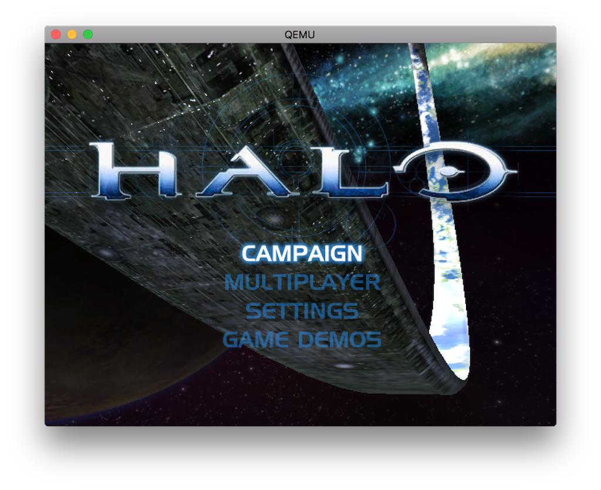

2.x Rebase
==========

Hello! This is the bleeding edge development branch focused on rebasing the
xqemu project onto the latest [Qemu](https://github.com/qemu/qemu) tag, which
at the time of writing is
[v2.12.0](https://github.com/qemu/qemu/tree/v2.12.0). This will bring
many years of performance enhancements to xqemu including support for native
virtualization APIs. If you are interested in helping to create a functional,
accurate, and **performant** Xbox emulator, you are **most welcome** to
contribute. Keep up with the latest developments. Chat with us on #xqemu on
irc.freenode.net or on [Discord](https://discord.gg/WxJPPyz).

Status
------
| Windows | Linux | macOS |
| ------- | ----- | ----- |
| [](https://ci.appveyor.com/project/mborgerson/xqemu-99msh/branch/xbox-2.x-rebase) | [](https://travis-ci.org/xqemu/xqemu) | [](https://travis-ci.org/xqemu/xqemu) |



Remaining Items Until Merge (Tentative Work List)
-------------------------------------------------
* Fix timers (rdtsc and pm timer)
* Simplify build by reducing amount of HW linked in 
* Cleanup and merging

macOS Build
-----------
Use the build script to build:

	./build_macos.sh
	
Then run with something like:
	
	./i386-softmmu/qemu-system-i386 \
		-cpu pentium3 \
		-machine xbox,bootrom=$MCPX \
		-m 64 \
		-bios $BIOS \
		-drive index=0,media=disk,file=$HDD,locked \
		-drive index=1,media=cdrom,file=$DISC \
		-usb -device usb-xbox-gamepad  \
		-monitor stdio \
		-s

This will start the Qemu monitor on the command line, which includes lots of
really helpful debugging commands!

The Xbox boot animation sequence can be bypassed by adding the
`,short-animation` option to the `-machine` switch above.

Windows Build
-------------
Start by setting up MSYS2 and follow the update guide on their [website](https://www.msys2.org/). Make sure you're open in `MSYS2 MinGW 64-bit`. Once that's done you should be able to up install all of the needed packages with...

```pacman -S git python2 make autoconf automake-wrapper mingw-w64-x86_64-libtool mingw-w64-x86_64-gcc mingw-w64-x86_64-pkg-config mingw-w64-x86_64-glib2 mingw-w64-x86_64-glew mingw-w64-x86_64-SDL mingw-w64-x86_64-SDL2 mingw-w64-x86_64-pixman```

Clone the repo
    
    git clone https://github.com/xqemu/xqemu.git

Then change directory

    cd xqemu

Then switch branch

    git checkout xbox-2.x-rebase

And run

    sh ././build_windows.sh
   

Linux Build
-----------
First enable `deb-src` via:

    sudo gedit /etc/apt/sources.list

In this file, uncomment first `deb-src` line. Now refresh packages:

    sudo apt-get update

Install build deps:

    sudo apt-get build-dep qemu 
    sudo apt-get install git libsdl2-dev libglew-dev

Then clone, checkout, and use the build script:

    ./build_linux.sh

Debugging on macOS
------------------
If your build of Qemu is crashing, I've found it easiest to use the Xcode
debugger to look at stack traces. Fire up Xcode, create a project, edit the
"Scheme" to run the xqemu binary, then click the run button. Xcode has a nice
GUI for analyzing the stack frame and looking at local variables to quickly
track down bugs. Let me know if you find a better method. You can also attach
to running processes. - @mborgerson

Appendix A: Keyboard-Controller Mapping
---------------------------------------

Defined in xid.c:
```
    [Q_KEY_CODE_UP]    = GAMEPAD_DPAD_UP,
    [Q_KEY_CODE_KP_8]  = GAMEPAD_DPAD_UP,
    [Q_KEY_CODE_DOWN]  = GAMEPAD_DPAD_DOWN,
    [Q_KEY_CODE_KP_2]  = GAMEPAD_DPAD_DOWN,
    [Q_KEY_CODE_LEFT]  = GAMEPAD_DPAD_LEFT,
    [Q_KEY_CODE_KP_4]  = GAMEPAD_DPAD_LEFT,
    [Q_KEY_CODE_RIGHT] = GAMEPAD_DPAD_RIGHT,
    [Q_KEY_CODE_KP_6]  = GAMEPAD_DPAD_RIGHT,

    [Q_KEY_CODE_RET]   = GAMEPAD_START,
    [Q_KEY_CODE_BACKSPACE] = GAMEPAD_BACK,

    [Q_KEY_CODE_W]     = GAMEPAD_X,
    [Q_KEY_CODE_E]     = GAMEPAD_Y,
    [Q_KEY_CODE_S]     = GAMEPAD_A,
    [Q_KEY_CODE_D]     = GAMEPAD_B,
    [Q_KEY_CODE_X]     = GAMEPAD_WHITE,
    [Q_KEY_CODE_C]     = GAMEPAD_BLACK,

    [Q_KEY_CODE_Q]     = GAMEPAD_LEFT_TRIGGER,
    [Q_KEY_CODE_R]     = GAMEPAD_RIGHT_TRIGGER,

    [Q_KEY_CODE_V]     = GAMEPAD_LEFT_THUMB,
    [Q_KEY_CODE_T]     = GAMEPAD_LEFT_THUMB_UP,
    [Q_KEY_CODE_F]     = GAMEPAD_LEFT_THUMB_LEFT,
    [Q_KEY_CODE_G]     = GAMEPAD_LEFT_THUMB_DOWN,
    [Q_KEY_CODE_H]     = GAMEPAD_LEFT_THUMB_RIGHT,

    [Q_KEY_CODE_M]     = GAMEPAD_RIGHT_THUMB,
    [Q_KEY_CODE_I]     = GAMEPAD_RIGHT_THUMB_UP,
    [Q_KEY_CODE_J]     = GAMEPAD_RIGHT_THUMB_LEFT,
    [Q_KEY_CODE_K]     = GAMEPAD_RIGHT_THUMB_DOWN,
    [Q_KEY_CODE_L]     = GAMEPAD_RIGHT_THUMB_RIGHT,
```
